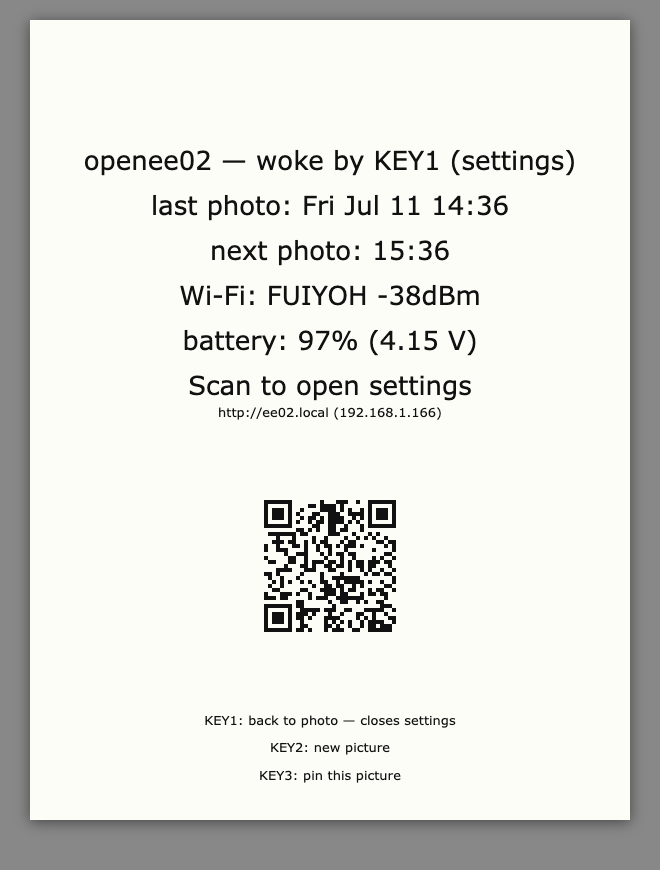
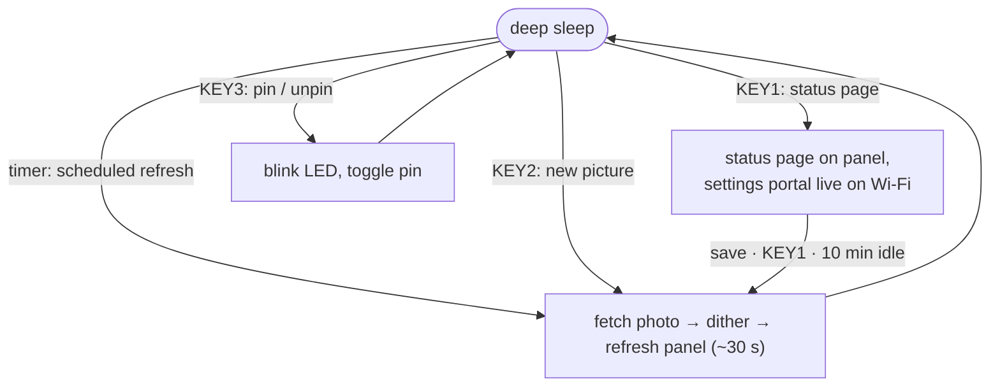
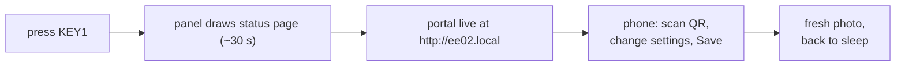

# openee02

[](../../actions/workflows/ci.yml)

Standalone, zero-cloud firmware for the **Seeed Studio XIAO ePaper Display
Board EE02** (XIAO ESP32-S3 Plus) driving a **13.3″ Spectra 6 e-ink panel**
(1200×1600, six colors) as a battery-powered photo frame.

Seeed ships the EE02 pre-flashed with SenseCraft HMI, a cloud-based no-code
dashboard tool that requires an account and an internet connection to
reconfigure. This firmware needs neither: every setting — refresh interval,
image source, quiet hours, timezone, orientation — is configured from your
phone talking directly to the device over your own Wi-Fi. Nothing else has
to run, ever.

<!-- PHOTO: frame on a wall showing a photo -->



*Mockup rendered from the actual drawing code — not a photo of the real
panel, which is glossier and paper-white. Real photo pending.*

On a schedule you choose it wakes from deep sleep, fetches a photo from a
URL you choose, dithers it to the panel's six colors, refreshes, and goes
back to sleep. Everything is configured **on the device itself** — no
account, no cloud, no companion server. This is a hobby project: support
is best-effort, MIT-licensed, no warranty.

## How it works

The firmware is one loop: sleep, wake for a reason, act, sleep again.



Timer wakes that have nothing to do — the photo is pinned, or the wake
lands inside quiet hours — roll straight back to sleep without touching
the panel or the radio.

## Supported hardware

Exactly one combo: the EE02 board with the 13.3″ Spectra 6 panel
(`BOARD_SCREEN_COMBO=510` in `platformio.ini`). Other XIAO ePaper combos
need changes to `platformio.ini` and `src/config.h` and are untested.

| Part | Source |
|---|---|
| XIAO ePaper Display Board EE02 (XIAO ESP32-S3 Plus) | Seeed Studio |
| 13.3″ Spectra 6 e-paper panel, 1200×1600 | Seeed Studio |
| 3.7 V Li-ion battery, JST 1.25 | any (see battery notes) |

## Buttons

| Silkscreen | GPIO | Function |
|---|---|---|
| KEY1 | 2 | Toggle the full-screen **status page**. While it shows, the **settings portal** is live on your Wi-Fi. |
| KEY2 | 3 | Fetch a **new picture** now. |
| KEY3 | 5 | **Pin/freeze** the current photo — scheduled refreshes pause (and barely sip battery) until pressed again. |
| RESET | — | Hardware reboot (clears boot counter and battery-delta memory). With BOOT held: flashing bootloader. |

Every press is acknowledged by the LED within ~0.5 s (1 blink = new
picture, 2 = status page, 3 = pin), because the panel itself takes
~25–30 s to change — that's Spectra 6 physics, and the panel has **no
partial-refresh mode** (color e-ink waveforms are full-panel only).

## First-time setup

1. Connect the panel's FPC cable, flip the power switch on, plug in USB-C.
2. The panel shows two QR codes: scan the first to join the frame's hotspot (EE02-Setup), and the setup page opens by itself (second QR / http://192.168.4.1 as fallback). Pick your 2.4 GHz network.
3. Credentials persist on-device (NVS). Nothing secret ever enters this repo.

## Settings

Press **KEY1**. The panel shows the status page (wake reason, last/next
refresh, Wi-Fi, battery) plus a URL and QR code — open it from any device
on the same Wi-Fi:



| Setting | Choices | Default |
|---|---|---|
| Refresh interval | 15 min – 24 h | 1 h |
| Image source URL | any http(s) URL template | picsum via weserv |
| Paused | pin/freeze (same as KEY3) | off |
| Quiet hours | skip refreshes in a nightly window | off |
| Timezone | auto (IP geolocation) or manual offset | auto |
| Device name | mDNS hostname (`<name>.local`) | `ee02` |
| Orientation | portrait / landscape, each flippable | portrait |

The page also has **Fetch new picture now** and **Forget Wi-Fi** buttons.
The portal stops when you leave the status page (press KEY1 again, save,
or 10 minutes idle) — the device then fetches a picture and sleeps.
Transient failures on scheduled refreshes never touch the panel — the
current photo stays up and the next wake retries.
If saved Wi-Fi stops working (new router, moved house), the frame
reopens the `EE02-Setup` hotspot by itself.

### Image source contract

The URL must return a **baseline (non-progressive) JPEG** at the panel
size. Tokens are substituted per fetch:

- `{width}` / `{height}` — panel size after orientation (1200×1600
  portrait, 1600×1200 landscape)
- `{seed}` — random number (cache-buster)

The default goes through images.weserv.nl because picsum serves
progressive JPEGs, which the on-device decoder can't parse; weserv
re-encodes to baseline at exact size. Pointing at your own server or a
static file works — just honor the contract. Please be a good citizen of
free services: one frame is nothing, a fleet is not.

## Privacy & security notes

- Image fetches use HTTPS **without certificate validation**
  (`setInsecure()`): an attacker on your network path could substitute
  the image. Accepted trade-off for a photo frame; noted for transparency.
- Timezone auto-detect calls `ip-api.com` over plain HTTP (their free,
  **non-commercial** tier) and reveals your public IP to them. Set a
  manual timezone in the portal to disable it entirely.
- The settings portal is HTTP on your LAN, unauthenticated — anyone on
  your Wi-Fi can change your photo frame's settings. Threat model: roommates.

## Building & flashing

PlatformIO CLI. The display driver is selected entirely by the two
`build_flags` in `platformio.ini` — never edit library files.

```bash
pio run -e ee02      # build firmware
pio run -t upload    # flash over USB-C
pio device monitor   # serial at 115200 (USB-CDC)
pio test -e native   # host-side unit tests (no hardware needed)
```

**Dev mode:** plugged into a computer, the board never sleeps —
`pio run -t upload` just works. A USB *host* is detected via the
USB-Serial-JTAG SOF frame counter, so chargers never trigger dev mode.
If it was last running on battery/charger (asleep, USB port gone), wake
it first: press any user button and run the upload within the wake window
(a port-watching loop works well: `until ls /dev/cu.usbmodem* 2>/dev/null;
do sleep 0.2; done; pio run -t upload`), wait for the scheduled self-wake,
or hold **BOOT**, tap **RESET**, release BOOT — then flash and press
RESET after. While plugged in, the settings portal stays reachable at
http://<name>.local the whole time — no KEY1 needed.

## Source layout

```
src/config.h      pins, buttons, defaults, constants
src/settings.*    runtime configuration (NVS-backed)
src/logic/        pure decision logic — host-testable, no Arduino deps
src/display.*     EPaper object, 6-color dither, JPEG decode
src/net.*         Wi-Fi provisioning (WiFiManager), photo fetch, timezone+NTP
src/portal.*      settings web portal (served while the status page shows)
src/portal_html.h embedded HTML for the settings portal
src/power.*       battery ADC + percent curve, LED, deep-sleep entry
src/state.h       shared globals (prefs, pin state)
src/ui.*          wake reason, status page, fetch metadata
src/main.cpp      wake dispatch: which wake does what
test/             native unit tests (pio test -e native)
```

## Hardware notes (hard-won)

- **The 4 bpp framebuffer is palette-indexed.** `TFT_*` color macros are
  panel nibbles (WHITE=0x0, GREEN=0x2, RED=0x6, YELLOW=0xB, BLUE=0xD,
  BLACK=0xF) and `drawPixel` stores `color & 0x0F`. Raw RGB565 pushed via
  `pushImage` renders garbage — photos must be dithered to the palette.
- **Deep sleep floats digital-only pads** — the panel/battery enable lines
  (GPIO43/6) are latched with `gpio_hold_en` before sleeping, released at
  boot. The held/quiet fast path (`quickSleep`) deliberately leaves them
  latched.
- **The TZ environment doesn't survive deep sleep** — it's reapplied from
  the NVS-cached offset at every boot, or non-fetch wakes render UTC.
- **Battery**: charged from USB-C through the board's BQ24070 (~300 mA
  fast charge, ~30 mA precharge below 3 V). Its **8-hour safety timer**
  latches a fault on deeply discharged large packs — both charge LEDs go
  dark and charging stops; unplug/replug USB to resume. The battery
  percent shown is a discharge-curve estimate, not a fuel gauge.
- ADC reads use `analogReadMilliVolts` (eFuse-calibrated); the naive
  `raw/4095*3.3` conversion reads 20–30 % low on the S3.

## License

MIT — see [LICENSE](LICENSE).
